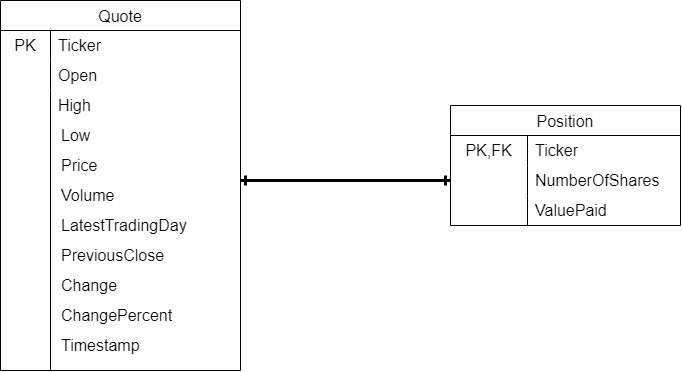

# JDBC Stock Quote Application

## Introduction
The JDBC Stock Quote Application is a Java-based command-line tool designed to manage and interact with stock market data. Utilizing JDBC (Java Database Connectivity) to connect to a PostgreSQL (psql) database, this application performs CRUD (Create, Read, Update, Delete) operations on stock quotes. Built with Maven, the project demonstrates database connection management, data access objects (DAO), and service layers. This practical example highlights the integration of Java applications with relational databases, specifically PostgreSQL, providing a robust solution for managing stock market information.

## Implementation
The JDBC Stock Quote Application is developed using Java and managed with Maven in IntelliJ IDEA. The application leverages OkHttpClient to handle HTTP requests and responses, and JSON objects are parsed to manage stock market data. Logging is managed through Log4j2, providing a robust logging framework for debugging and monitoring.

The application interacts with a PostgreSQL (psql) database for storing and retrieving stock quotes. For testing, JUnit and Mockito are utilized to ensure the reliability and correctness of the application’s functionality. Additionally, Docker is used to containerize the application, streamlining deployment and ensuring consistency across different environments.

The core functionality is encapsulated in the StockQuoteApp Java class, which contains the main method to start up the application.
## ER Diagram

## Design Patterns
### Dao Pattern
DAO Pattern
The JDBC Stock Quote Application utilizes the Data Access Object (DAO) pattern to manage interactions with the database. The DAO pattern abstracts and encapsulates all access to the data source, handling CRUD operations for specific entities such as stock quotes and positions. This separation of data access logic from business logic enhances the maintainability and testability of the application, allowing for easier updates and modifications to the database without impacting the rest of the system.

### Repository Pattern
In addition to the DAO pattern, the application leverages the Repository pattern to provide a more domain-centric interface to the data. The Repository pattern acts as an intermediary between the business logic and the DAO, offering a higher level of abstraction by managing queries, aggregation, and in-memory collections. This approach simplifies data access by offering a more intuitive interface for the business layer, promoting clean architecture and making the system more flexible and scalable.

## Test
### Database Setup
To test the JDBC Stock Quote Application, you'll need to set up a database that the application can interact with. Typically, this involves creating a test database that mirrors the structure of the production database. You can use an in-memory database like H2 for testing purposes, or set up a local instance of your preferred relational database (e.g., MySQL, PostgreSQL). Ensure that the database schema matches the one defined in your application.

### Test Data Setup
Before running tests, populate the test database with a predefined set of data. This data should represent typical use cases and edge cases for your application, allowing you to validate that the DAO and Repository layers perform as expected. You can automate this setup process using SQL scripts or data migration tools.

### Running Tests
The application uses JUnit 4 for testing, along with Mockito for mocking dependencies. To test the database operations:

Unit Tests: These tests mock the database interactions, allowing you to validate the logic in isolation without a real database connection.

Integration Tests: These tests run against the actual database, verifying that the queries and data manipulation operations behave as expected.
### Query Result Verification
After running the tests, the results are verified by comparing the actual output from the database queries with the expected results. This ensures that the application correctly interacts with the database, performs accurate CRUD operations, and handles different scenarios (e.g., edge cases, errors) effectively.

Running these tests regularly helps maintain the integrity of the application as changes are made, ensuring that the database interactions remain reliable and consistent.