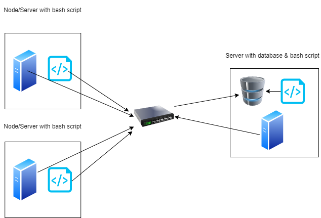

## Introduction
The Jarvis Linux Cluster Administration (LCA) team oversees a small network of servers, all 
linked together through a switch. Our task is to keep track of each server's hardware details and 
monitor their resource usage, such as CPU and memory, in real-time. We use bash scripts to collect the 
information from our machines and store this information in a relational database using a PostgreSQL
instance running in docker.

## Quick Start
<ul>
  <li>Starting, stopping, or creating a psql instance:</li>

    ./scripts/psql_docker.sh start|stop|create [username][password]
  <li>Creating tables if they don't already exist:</li>

    psql -h [host] -U [username] -d [database] -f sql/ddl.sql
  <li>Inserting hardware specs:</li>

    ./scripts/host_info.sh [host] [port] [database] [username] [password]
  <li>Inserting usage specs:</li>

    ./scripts/host_usage.sh [host] [port] [database] [username] [password]
<li>Crontab setup:</li>

    crontab -e

    * * * * * bash [path to host_usage script] [host] [post] [database] [username] [password] > /tmp/host_usage.log
</ul>

## Implementation
I implemented the Jarvis Linux Cluster Administration (LCA) application to efficiently manage and monitor a 
Linux cluster of servers. Using a combination of Bash scripts and PostgreSQL (psql), I automated the 
recording of hardware specifications and real-time resource usage for each node. I used Docker 
to containerize and run the PostgreSQL database, ensuring a consistent and isolated environment. For version 
control, I adopted the Gitflow methodology and used GitHub to track code changes and manage branches systematically.

## Architecture

## Scripts
<ul>
    <li>psql_docker.sh</li>

    ./scripts/psql_docker.sh start|stop|create [username][password]

This script is used to control your connections to psql and docker. You can choose 
to either create, start, or stop the docker container and the psql instance. If you choose
to create a docker container and psql connection you must provide a username and password.

<li>host_info.sh</li>

    ./scripts/host_info.sh [host] [port] [database] [username] [password]

This script is used to gain hardware information of the machine and store it once in the
host info database. This script collects information such as the hostname, how many CPU's it contains,
what the CPU architecture is, the CPU model, etc.

<li>host_usage.sh</li>

    ./scripts/host_usage.sh [host] [port] [database] [username] [password]

This script gets called every minute to gain information on the hardware usage and stores 
it in the host usage database. This script gets called from the cron table to collect information such
as how much of the CPU is idle, how much memory is free, how much is available on the disk, etc.

<li>crontab/li>

    crontab -e

    * * * * * bash [path to host_usage script] [host] [post] [database] [username] [password] > /tmp/host_usage.log

The cron table in Linux is a tool that can run processes and tasks repeatedly. In this case, we are using the
cron tool to run our host usage script every minute.

</ul>

## Database Modeling
The host_usage and host_info are separated into two tables in the host_agent database. The primary key in 
host_info is the id of the host which is given when the script runs and inserts a new row in the database.
In the host_usage table, it uses the host id as its foreign key to be able to identify which host the information
is being collected from. These tables have a one-to-many relationship: one host in host_info to many host_usage.

## Test
Tests were done on one machine as right now the scope is smaller. The bash scripts were tested and debugged
using bash -x as well as testing different inputs possibles (or lack of inputs). If there was an error of any kind
it would give back an exit code of 1 or higher. For testing the ddl script, I tested it against the database in
different scenarios such as already having the tables, not having any tables, or only having one table.

## Deployment
The automation of the host_usage script was done by utilizing the cron tool in Linux. A docker container
was used to run PostgreSQL and GitHub was used as a version control.

## Improvements
<ul>
    <li>Adding GUI to read information</li>
    <li>Running the application in docker (make it more accessible )</li>
    <li>Make the application for all operating systems (not just Linux)</li>
</ul>
